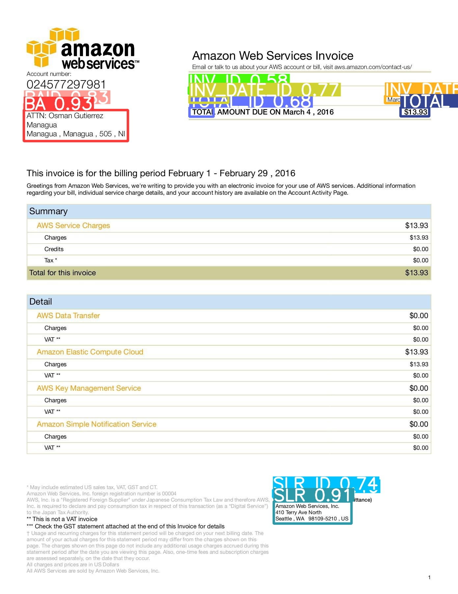
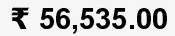
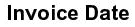
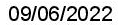
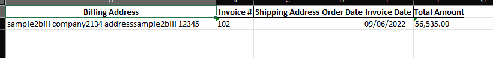

# Invoice Data Extraction System

This project aims to automate the extraction of data from invoice images using a combination of YOLOv8 for object detection and Optical Character Recognition (OCR) for text extraction. The system can identify specific fields such as invoice ID, total amount, address, etc., and convert the extracted information into an Excel sheet with appropriate headings.

## Table of Contents
- [Features](#features)
- [Installation](#installation)
- [Usage](#usage)
- [Model Training](#model-training)
- [OCR Integration](#ocr-integration)
- [Output](#output)
- [Screenshots](#screenshots)
- [Contributing](#contributing)
- [License](#license)

## Features
- Train YOLOv8 on annotated invoice images.
- Detect specific fields on new invoice images.
- Extract text from detected fields using OCR.
- Export extracted data to an Excel sheet.

## Installation
1. Clone the repository:
    ```bash
    git clone https://github.com/jawadshahid07/Invoice-Data-Extraction-System.git
    cd invoice-data-extraction
    ```
2. Set up a Python virtual environment:
    ```bash
    python -m venv venv
    source venv/bin/activate  # On Windows use `venv\Scripts\activate`
    ```
3. Install required packages:
    ```bash
    pip install -r requirements.txt
    ```
4. Download, install, and setup Tesseract OCR. Here is the documentation: https://tesseract-ocr.github.io/

## Usage
1. (OPTIONAL) There is already a trained model present with the file name "yolov8n.pt". You may train your own model, with your own code or by modifying the code. The code for training the model is in the file "yolov8_model_training_for_invoices.ipynb".
2. (OPTIONAL) To visualize how the model works on invoice images, you may use the code in the file "yolov8 predict.ipynb", which outputs in an image with annotated results. 
3. To use the project, we first run the code in "yolov8 extraction.ipynb", which takes an image, identifies labels on it, and extracts each label as it's own image file. The name of the image indicates the label. The extracted data in form of images is saved in "savedimages" directory.
4. We then run the "ocr to excel.ipynb". This code uses Tesseract OCR to convert each of the images, which contain one label, to text and stores it in an excel sheet under the correct heading. The output is your excel sheet.

## Model Training
1. Annotate your invoice images with fields such as invoice ID, total amount, address, etc.
2. Use the YOLOv8 framework to train the model with these annotated images.
3. Save the trained model weights.

## OCR Integration
1. Use Tesseract OCR library to extract text from the detected fields.
2. Map the detected fields to the corresponding text extracted by the OCR.

## Output
The final output will be an Excel sheet with the extracted data, organized with appropriate headings.

## Screenshots
  
*Caption: YOLOv8 detecting fields on an invoice.*

     
*Caption: Results of the prediction code, separating each label into it's own image*

  
*Caption: Extracted data saved in an Excel sheet.*

## Contributing
Contributions are welcome! Please open an issue or submit a pull request for any changes.
